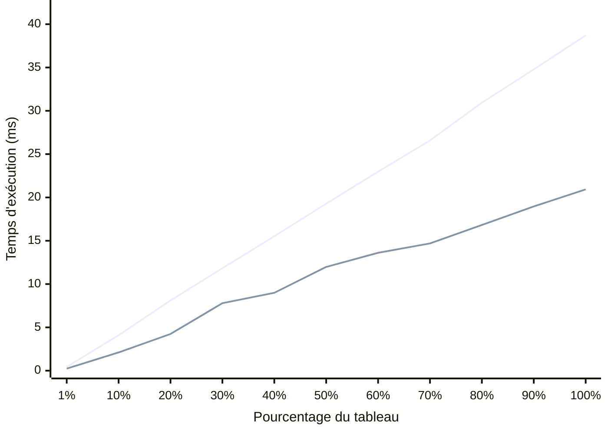

# INF2007 – TN4 – Melissa Moya

## Approche et structure du programme

Le programme calcule la somme des sinus d'un tableau de 1 000 000 d'éléments, en entiers ou en flottants selon le flag `--type`. L'implémentation est organisée en trois parties. `generateIntArray` et `generateFloatArray` créent les tableaux avec `rand.NewSource(42)` afin que chaque exécution produise les mêmes données, ce qui garantit la reproductibilité des benchmarks. L'utilisation de `crypto/rand` aurait introduit un coût de génération non pertinent pour la mesure. `computeSineSumInt` et `computeSineSumFloat` contiennent la boucle de calcul spécialisée pour chaque type, et `computeSineSum` effectue le dispatch via un `switch` sur la valeur reçue en `interface{}`. Les benchmarks passent par `computeSineSum` afin de mesurer le programme dans sa forme d'exécution réelle, dispatch inclus. Le surcoût du `switch` et de l'assertion de type reste faible par rapport à `math.Sin`, mais ce choix rend la mesure plus représentative.

*Pour les résultats complets des tests, benchmarks et captures d'écran, voir le dossier [Results-and-Instructions](Results-and-Instructions/).*

## Résultats des benchmarks

Les mesures reposent sur `testing.B`, l'outil adapté au benchmarking en Go. Les `time.Since` dans `main` ne servent qu'à fournir une indication à l'utilisateur et ne sont pas utilisées pour l'analyse. `testing.B` ajuste automatiquement le nombre d'itérations (`b.N`) pour stabiliser la mesure, et `b.ResetTimer()` est appelé avant chaque boucle afin d'exclure le coût du setup. Les 22 sous-benchmarks (11 paliers par type) ont été exécutés avec `go test -bench=. -benchmem -count=6` sur un Intel i5-10300H à 2.50 GHz sous Windows/amd64 avec 8 threads, puis analysés avec `benchstat` pour obtenir les médianes et les intervalles de confiance à 95 %. Le résultat à `0 B/op` montre qu'aucune allocation mémoire significative n'apparaît dans le chemin mesuré. Le fichier de test contient 13 tests unitaires et atteint une couverture de 100 %. En complément des 4 tests demandés, des tests ont été ajoutés pour les valeurs négatives, les flottants extrêmes (`1e15`), le dispatch avec des données incompatibles, la fonction `run` pour chaque type, et `main` elle-même.

### Méthode expérimentale

Cette étude s'appuie sur `testing.B`, qui répète automatiquement l'opération via `b.N` jusqu'à obtenir une mesure stable, puis présente les résultats en `ns/op` et `B/op`. L'appel à `b.ReportAllocs()` rend visible le coût mémoire, et les résultats à `0 B/op` indiquent que la différence de performance provient surtout du calcul et de l'accès séquentiel au tableau, plutôt que d'allocations cachées. Comme les tableaux sont parcourus linéairement, l'accès reste favorable au cache; lorsque la taille augmente, l'effet de la hiérarchie mémoire devient plus visible. Enfin, l'utilisation de `rand.NewSource(42)` rend les données reproductibles, ce qui permet de comparer les benchmarks d'une exécution à l'autre dans des conditions cohérentes.

**Tableau 1 – Temps de calcul par type et pourcentage du tableau (1 000 000 éléments)**

| % du tableau | Éléments | Int (ms) | Float (ms) | Ratio |
|:---:|:---:|:---:|:---:|:---:|
| 1 % | 10 000 | 0.44 | 0.24 | 1.86× |
| 10 % | 100 000 | 4.09 | 2.11 | 1.94× |
| 20 % | 200 000 | 8.11 | 4.24 | 1.91× |
| 30 % | 300 000 | 11.83 | 7.79 | 1.52× |
| 40 % | 400 000 | 15.52 | 8.99 | 1.73× |
| 50 % | 500 000 | 19.28 | 11.98 | 1.61× |
| 60 % | 600 000 | 22.98 | 13.61 | 1.69× |
| 70 % | 700 000 | 26.58 | 14.69 | 1.81× |
| 80 % | 800 000 | 30.94 | 16.82 | 1.84× |
| 90 % | 900 000 | 34.78 | 18.96 | 1.83× |
| 100 % | 1 000 000 | 38.71 | 20.93 | 1.85× |

Les flottants sont systématiquement plus rapides avec un ratio d'environ 1.5 à 1.9×. En passant de 50 % à 100 %, le temps double presque exactement (19.28 vers 38.71 ms pour Int, 11.98 vers 20.93 ms), ce qui confirme la complexité O(n). Les valeurs proviennent des médianes `benchstat` sur 6 exécutions, avec des intervalles de confiance de ± 1 % pour les paliers les plus longs (90–100 %). Aucune allocation mémoire n'a été détectée (0 B/op). Ces résultats servent de base à l'analyse qui suit.

**Graphique 1 – Temps de calcul selon le pourcentage du tableau (Int vs Float)**

> **Courbe du haut (mauve claire)** — Int (entiers, avec conversion `float64`)  
> **Courbe du bas (mauve foncée)** — Float (flottants, sans conversion)

*Pour la méthode de construction du graphique, voir [Guide-creation-graphique-Mermaid.md](Results-and-Instructions/Guide-creation-graphique-Mermaid.md).* 

La courbe Int progresse de façon quasi linéaire, tandis que la courbe Float présente de légères irrégularités (notamment aux paliers 30 % et 70 %). Les deux séries restent compatibles avec une complexité linéaire, et ces écarts s'expliquent surtout par le bruit de mesure : les benchmarks Float étant plus rapides, une même perturbation (interruption système, variation de fréquence, effet thermique) a un impact relatif plus visible. Les intervalles de confiance `benchstat` le confirment : Float/30pct affiche ± 7 % contre ± 1 % pour Int/100pct. L'écart entre Int et Float s'explique par la conversion `float64(v)` effectuée à chaque itération. Cette conversion ajoute un coût supplémentaire, mais la différence observée reflète surtout le coût global de la boucle et de `math.Sin`, plutôt qu'un seul effet isolé.

En pratique, les courbes ne reflètent pas seulement le coût de `math.Sin`. Quand le tableau grossit, une plus grande partie des données sort des caches L1 et L2, puis L3, ce qui rend la composante mémoire plus visible. Il est donc nécessaire de commenter la forme de la courbe, et pas seulement une valeur moyenne : le calcul reste séquentiel et favorable au cache, mais les grandes tailles tendent à être davantage influencées par la hiérarchie mémoire et la bande passante.

## Applications numériques

Les benchmarks à 100 % du tableau donnent le temps moyen par appel à `math.Sin`. La médiane `benchstat` du benchmark Int est de 38 710 000 ns/op pour 1 000 000 d'éléments, soit $38\,710\,000 \div 1\,000\,000 = 38.7$ ns par sinus. La médiane Float est de 20 930 000 ns/op, soit $20\,930\,000 \div 1\,000\,000 = 20.9$ ns par sinus. Ces deux valeurs servent de base aux questions suivantes.

**Question 1 – Quelle distance parcourt la lumière pendant le calcul d'un sinus ?**

La vitesse de la lumière est $c = 299\,792\,458$ m/s. On multiplie par le temps d'un sinus converti en secondes.

$$d_{int} = 299\,792\,458 \times \frac{38.7}{1\,000\,000\,000} = 11.6 \text{ mètres}$$

$$d_{float} = 299\,792\,458 \times \frac{20.9}{1\,000\,000\,000} = 6.3 \text{ mètres}$$

**Réponse.** La lumière parcourt entre 6 et 12 mètres pendant un seul calcul de sinus.

**Question 2 – Combien de sinus peut-on calculer par tick à 120 fps ?**

Un tick à 120 fps dure $\frac{1}{120} = 8\,333\,333$ ns. On divise par le temps d'un sinus.

$$n_{int} = \frac{8\,333\,333}{38.7} \approx 215\,333 \text{ sinus par tick}$$

$$n_{float} = \frac{8\,333\,333}{20.9} \approx 398\,726 \text{ sinus par tick}$$

**Réponse.** On peut calculer environ 215 000 sinus (Int) ou 399 000 sinus (Float) par tick. En pratique, si une partie du budget de frame doit être conservée pour le rendu et le reste du moteur, ces valeurs donnent une marge confortable pour des effets visuels simples.

*Pour les détails de chaque calcul, voir [Guide-applications-numeriques.md](Results-and-Instructions/Guide-applications-numeriques.md).*

Au final, même une opération mathématique courante comme `math.Sin` a un coût mesurable à l'échelle du processeur, et ce travail permet de le quantifier de manière reproductible.

### Liens

- Dépôt GitHub [github.com/moyamelissa/Advanced-Programming/tree/main/TN4](https://github.com/moyamelissa/Advanced-Programming/tree/main/TN4)
- Implémentation [sinesum.go](sinesum.go)
- Tests et benchmarks [sinesum_test.go](sinesum_test.go)

### Bibliographie

- Documentation Go `math/rand`, `testing`, `flag` sur https://pkg.go.dev
- Documentation Mermaid XY Chart https://mermaid.js.org/syntax/xyChart.html
- GitHub Copilot, utilisé comme assistant avec vérification systématique des suggestions
